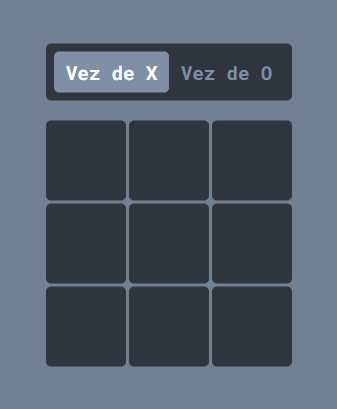

<h1 align="center">Jogo da Velha</h1>

<p align="center">

</p>

## [Estartando Devs](https://www.estartandodevs.com.br/):
Tarefa feita para Estartando Devs. O Estartando Devs é um projeto social e tem como objetivo transformar o mundo através da educação e tecnologia.

#

## 🎯 [Projeto - jogo da velha](https://pablokaua.github.io/jogo-da-velha-html-css/)

<p align="center">

</p>

Jogo da velha feito a partir de HTML, CSS e JavaScript

### Demonstração:
<p align="center">

</p>

#

## 💻 Tecnologias:
- DOM
- CSS
- HTML

#

## 👥 Clone o projeto:

```
git clone https://github.com/pablokaua/jogo-da-velha-html-css.git
```